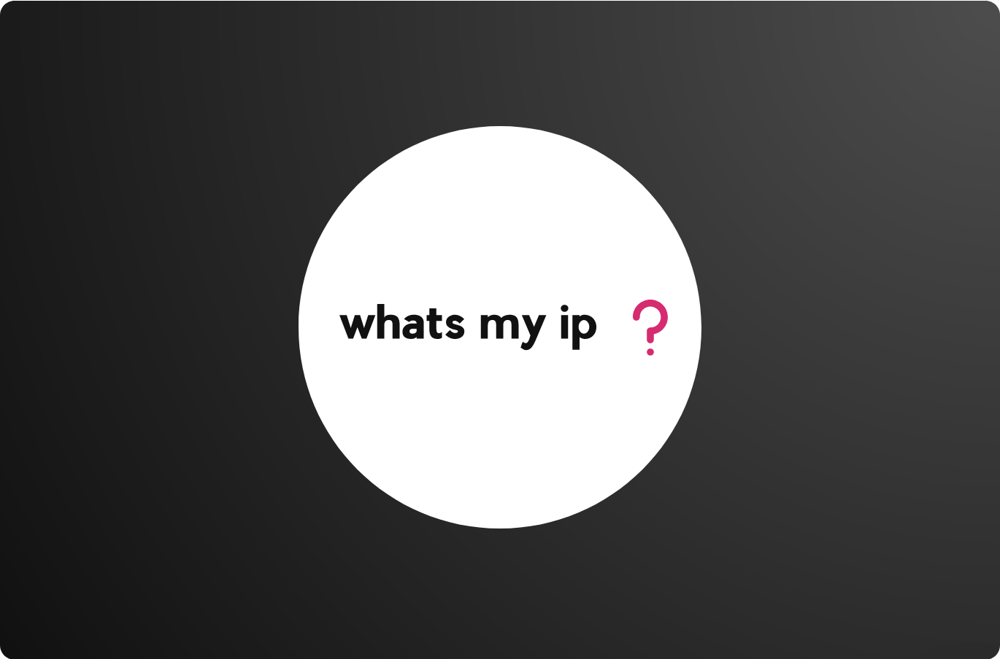

# whats my ip



## Motivation

I need a service to retrieve the external ip address of my services.
This is a simple golang lambda which achieves that.

## Deploy

```
$ up
```

## Usage

```
$ curl `up url`
```
